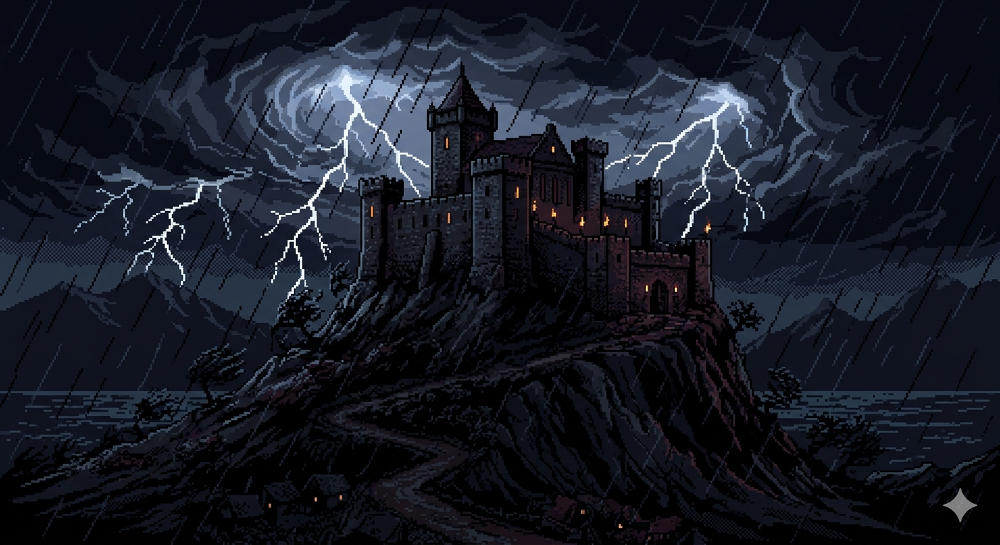

# Castle of the Winds

> *A tribute to Rick Saada's 1993 shareware RPG*



---

## What Is This

A dungeon crawling RPG built in the style of the classic 1993 Windows shareware game.
You are an adventurer of questionable judgement who has discovered a labyrinth beneath
the town of Thornwall. The mad archmage who built it vanished long ago. His gold did not.

Survive. Descend. Repeat. Try not to die to a scorpion on level one.

---

## Features

- **Procedural dungeons** — every floor is generated fresh with guaranteed entry/boss room
  separation and multiple corridor routes on medium/large levels
- **Win 3.1 aesthetic** — full Windows 3.1 chrome: title bar, menu bar, sidebar panels,
  modal dialogs, the works
- **Town hub** — Thornwall with a Blacksmith, Merchant, supply crates, and Elder Gareth
  dispensing unsolicited advice
- **Combat system** — bump-to-attack, stat-based damage, enemy AI, boss fights
- **XP & leveling** — assign STR / DEX / INT / CON points each level; reset and reassign
  before confirming
- **Full inventory** — equip weapons, armor, shields, helms; drink potions; use stat scrolls
- **Fog of war** — only explored tiles visible; map overlay with portal markers
- **Right-click examine** — right-click anything: enemies show stats, items show bonuses,
  tiles show type, right-click yourself for existential commentary
- **Stat tooltips** — right-click any stat in the panel or level-up screen for a description
- **In-game help** — full Adventurer's Handbook accessible via `?` key

---

## Controls

| Key | Action |
|-----|--------|
| `WASD` / Arrows | Move |
| `Q E Z C` | Move diagonally |
| `I` | Inventory |
| `M` | Map overview |
| `ESC` | Menu (rest / restart / quit) |
| `?` or `/` | Help handbook |
| `` ` `` | Debug console |
| Right-click | Examine tile / entity |

---

## Running Locally

```bash
npm install
npm run dev
```

Opens at `http://localhost:5173`

---

## Tech

- **Vite 8** + **TypeScript** — zero-framework, canvas-rendered
- Sprite atlas generated at runtime from a single spritesheet
- Dungeon generator: BSP-adjacent room placement, guaranteed entry room at fixed
  coordinates, L-corridor + diagonal carving, extra corridors for loops on larger maps
- FOV: recursive shadowcasting

---

## The Original

*Castle of the Winds* (1993) by Rick Saada — one of the first commercial Windows RPGs,
distributed as shareware, beloved by anyone who had a 486 and too much free time.
This is a spiritual reimagining, not a port.

---

*"The caves are dark. The enemies are rude. The loot is worth it."*
